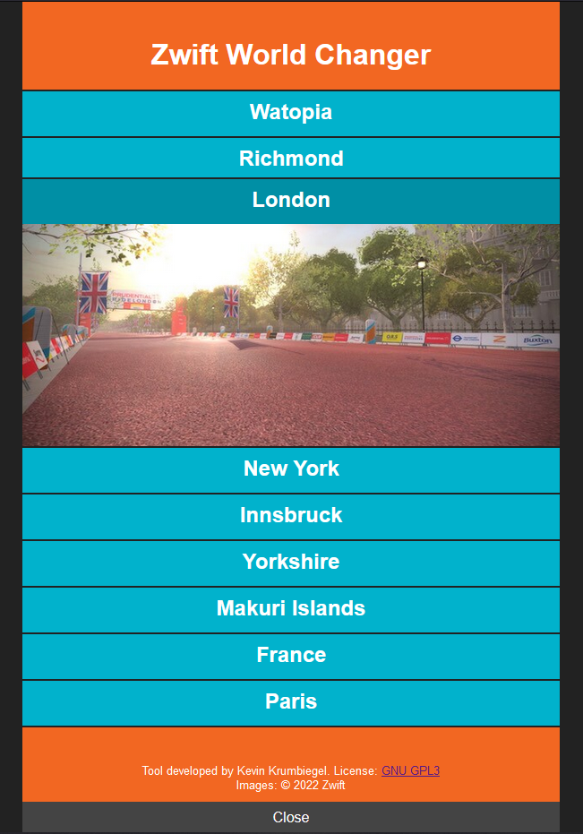

# ZwiftWorldChanger

This tool can be used to easily change the active world in the virtual running and cycling platform _Zwift_.

</img>

## Prerequisites
The tool requires Windows and python3 installed on your device.
You can get and install python3 from their official web page: https://www.python.org/downloads/

## Setup

1. Download the latest release (on the right of this page)
2. Extract the downloaded archive to a well-known place.

## Usage
1. Double-click the _run.bat_ file.
2. Now, a browser window will open.
3. Click on the desired world.
4. Start the Zwift client
